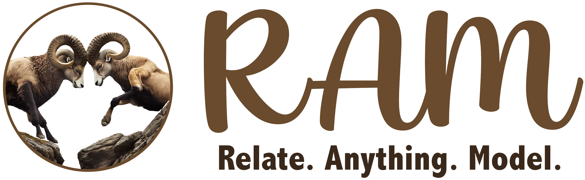
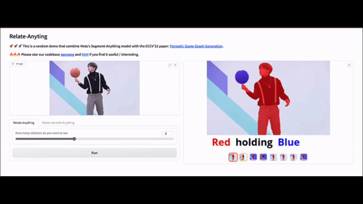
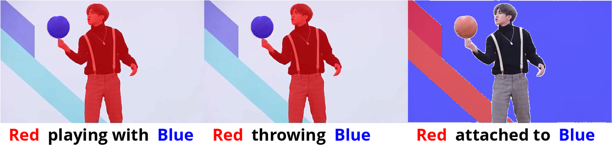
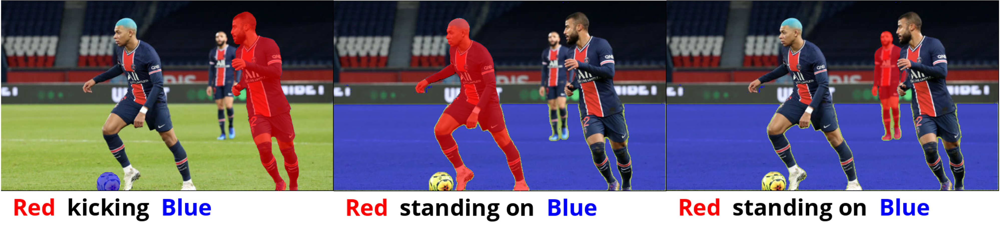
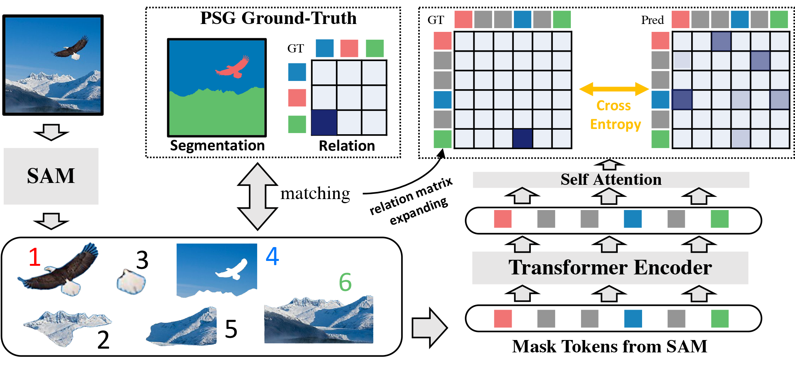

<p align="center" width="100%">

</p>

# RAM: Relate-Anything-Model

The following developers have equally contributed to this project in their spare time, the names are in alphabetical order.

[Zujin Guo](https://scholar.google.com/citations?user=G8DPsoUAAAAJ&hl=zh-CN), 
[Bo Li](https://brianboli.com/), 
[Jingkang Yang](https://jingkang50.github.io/), 
[Zijian Zhou](https://sites.google.com/view/zijian-zhou/home).

**Affiliate: [MMLab@NTU](https://www.mmlab-ntu.com/)** & **[VisCom Lab, KCL/TongJi](https://viscom.nms.kcl.ac.uk/)**

---

🚀 🚀 🚀 This is a demo that combine Meta's [Segment-Anything](https://segment-anything.com/) model with the ECCV'22 paper: [Panoptic Scene Graph Generation](https://psgdataset.org/). 

🔥🔥🔥 Please star our codebase [OpenPSG](https://github.com/Jingkang50/OpenPSG) and [RAM](https://github.com/Luodian/RelateAnything) if you find it useful/interesting.

[[`Huggingface Demo`](https://huggingface.co/spaces/mmlab-ntu/relate-anything-model)]

[[`Dataset`](https://psgdataset.org/)]

Relate Anything Model is capable of taking an image as input and utilizing SAM to identify the corresponding mask within the image. Subsequently, RAM can provide an analysis of the relationship between any arbitrary objects mask. 

The object masks are generated using SAM. RAM was trained to detect the relationships between the object masks using the OpenPSG dataset, and the specifics of this method are outlined in a subsequent section.

[](https://postimg.cc/k2HDRryV)

## Examples

Our current demo supports:

(1) generate arbitary objects masks and reason relationships in between. 

(2) given coordinates then generate object masks and reason the relationship between given objects and other objects in the image.

We will soon add support for detecting semantic labels of objects with the help of [OVSeg](https://github.com/facebookresearch/ov-seg).

Here are some examples of the Relate Anything Model in action about playing soccer, dancing, and playing basketball.

<!--  -->






## Method

<p align="center" width="100%">

</p>

Our method is based on the winning solution of the PSG competition, with some modifications. The original report can be found [here](https://arxiv.org/abs/2302.02651).

### Inference
Our approach uses the Segment Anything Model (SAM) to identify and mask objects in an image. The model then extracts features for each segmented object. We use a Transformer module to enable interaction between the object features, allowing us to compute pairwise object relationships and categorize their interrelations.

### Training
We train our model using [the PSG dataset](http://psgdataset.org/). For each training PSG image, SAM segments multiple objects, but only a few of them match the ground truth (GT) masks in PSG. We perform a simple matching between SAM's predictions and the GT masks based on their intersection-over-union (IOU) scores, so that (almost) every GT mask is assigned to a SAM mask. We then re-generate the relation map according to SAM's masks. With the GT data prepared, we train our model using cross entropy loss, as shown in the figure above.

## Setup

To set up the environment, we use Conda to manage dependencies.
To specify the appropriate version of cudatoolkit to install on your machine, you can modify the environment.yml file, and then create the Conda environment by running the following command:

```bash
conda env create -f environment.yml
```

Make sure to use `segment_anything` in this repository, which includes the mask feature extraction operation.

Download the pretrained model
1. SAM: [link](https://dl.fbaipublicfiles.com/segment_anything/sam_vit_h_4b8939.pth)
2. RAM: [link](https://1drv.ms/u/s!AgCc-d5Aw1cumQapZwcaKob8InQm?e=qyMeTS)

Place these two models in `./checkpoints/` from the root directory.

### **Gradio demo**
- We also provide a UI for testing our method that is built with gradio. This demo also supports generating new directions on the fly! Running the following command in a terminal will launch the demo: 
    ```
    python app.py
    ```
- This demo is also hosted on HuggingFace [here](https://huggingface.co/spaces/mmlab-ntu/relate-anything-model).

<!-- ## Developers

We have equally contributed to this project in our spare time, in alphabetical order.
[Zujin Guo](https://scholar.google.com/citations?user=G8DPsoUAAAAJ&hl=zh-CN), 
[Bo Li](https://brianboli.com/), 
[Jingkang Yang](https://jingkang50.github.io/), 
[Zijian Zhou](https://sites.google.com/view/zijian-zhou/home).

**[MMLab@NTU](https://www.mmlab-ntu.com/)** & **[VisCom Lab, KCL](https://viscom.nms.kcl.ac.uk/)** -->

## Acknowledgement

We thank [Chunyuan Li](https://chunyuan.li/) for his help in setting up the demo.

## Citation
If you find this project helpful for your research, please consider citing the following BibTeX entry.
```BibTex
@inproceedings{yang2022psg,
    author = {Yang, Jingkang and Ang, Yi Zhe and Guo, Zujin and Zhou, Kaiyang and Zhang, Wayne and Liu, Ziwei},
    title = {Panoptic Scene Graph Generation},
    booktitle = {ECCV}
    year = {2022}
}

@inproceedings{yang2023pvsg,
    author = {Yang, Jingkang and Peng, Wenxuan and Li, Xiangtai and Guo, Zujin and Chen, Liangyu and Li, Bo and Ma, Zheng and Zhou, Kaiyang and Zhang, Wayne and Loy, Chen Change and Liu, Ziwei},
    title = {Panoptic Video Scene Graph Generation},
    booktitle = {CVPR},
    year = {2023},
}
```
